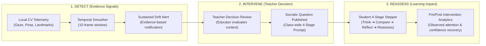

# Attenova — Comprehensive Project Workflow & System Architecture Guide

Welcome to the complete architectural and workflow documentation for **Attenova — Pedagogical Attention Intelligence & Socratic Learning System**. This document provides an end-to-end explanation of how the system works, its component hierarchy, computer vision pipelines, backend architecture, teacher management capabilities, student dashboard visual identity, and real-time Socratic intervention loops.

---

## 📑 Table of Contents
1. [System Overview & High-Level Architecture](#1-system-overview--high-level-architecture)
2. [Core Components & Directory Structure](#2-core-components--directory-structure)
3. [Computer Vision & On-Device ML Pipeline](#3-computer-vision--on-device-ml-pipeline)
4. [Backend Architecture & Data Flow (FastAPI & WebSockets)](#4-backend-architecture--data-flow-fastapi--websockets)
5. [Teacher Panel & Classroom Management Workflow](#5-teacher-panel--classroom-management-workflow)
6. [Student Experience & Dashboard Systems](#6-student-experience--dashboard-systems)
   - [Web Dashboard — Calm Focus Identity](#web-dashboard--calm-focus-identity)
   - [Desktop Client — Focus Companion Identity](#desktop-client--focus-companion-identity)
7. [The Socratic Intervention Closed-Loop System](#7-the-socratic-intervention-closed-loop-system)
8. [Privacy, Data Security & On-Device Execution](#8-privacy-data-security--on-device-execution)

---

## 1. System Overview & High-Level Architecture

Attenova is designed to bridge the gap between online distance learning and real-time classroom engagement. It combines **on-device computer vision**, **machine learning classification**, **real-time WebSocket telemetry**, and **Socratic pedagogy** to help teachers understand student attention trends without invading privacy.

```
┌──────────────────────────────────────────────────────────────────────────┐
│                      Python Student Desktop Client                       │
│  • OpenCV Webcam Capture               • MediaPipe Face Landmarker (478) │
│  • YOLOv8 Phone Detector               • MediaPipe Hands Landmarker      │
│  • Random Forest ML Classifier         • TemporalSmoother (15-frame)     │
│  • Focus Companion Tkinter Desktop UI  • Local Privacy Guarantee         │
└────────────────────────────────────┬─────────────────────────────────────┘
                                     │ Telemetry Stream (JSON WebSocket / HTTP)
                                     ▼
┌──────────────────────────────────────────────────────────────────────────┐
│                          FastAPI Backend Server                          │
│  • JWT Auth & Rate Limiting            • WebSocket Telemetry Broadcaster │
│  • Live Classroom State Manager        • Socratic Intervention Engine    │
│  • MongoDB & In-Memory Storage         • Attention Analytics & Reports   │
└──────────────────┬───────────────────────────────────────┬───────────────┘
                   │                                       │
                   │ Real-time Telemetry                   │ Socratic Prompts
                   ▼                                       ▼
┌──────────────────────────────────────┐ ┌─────────────────────────────────┐
│     Teacher Web Dashboard (Vite)     │ │   Student Web Dashboard (Vite)  │
│  • Live Monitor & Attention Heatmap  │ │  • Calm Focus Visual Identity   │
│  • Socratic Question Publisher       │ │  • Active Socratic Workspace    │
│  • Roster & Individual Sparklines    │ │  • Course Cards & Progress Goal │
│  • Historical PDF / Excel Analytics  │ │  • AI Cognitive Peak Hours Tip  │
└──────────────────────────────────────┘ └─────────────────────────────────┘
```

---

## 2. Core Components & Directory Structure

The project is structured into three primary sub-systems: **Backend**, **Frontend**, and **Client**:

```
Project_testing/
├── backend/                  # FastAPI Backend Application
│   ├── app/
│   │   ├── main.py           # Core FastAPI app, WebSocket routes, telemetry broadcast
│   │   ├── auth.py           # JWT authentication, password hashing, rate limiting
│   │   ├── database.py       # MongoDB collections (teachers, students, classes, sessions)
│   │   ├── analytics_service.py # Attention session reports, PDF & Excel generation algorithms
│   │   └── socratic_service.py  # Socratic question publishing & attempt tracking
├── client/                   # Python Desktop Student Client
│   ├── tracker.py            # Focus Companion Tkinter UI & OpenCV CV pipeline loop
│   ├── ui_console.py         # Visual overlays (Face mesh, Iris, Gaze, Bounding boxes)
│   └── __main__.py           # Application launcher (`python -m client`)
├── ml/                       # Machine Learning Model & Training Pipeline
│   ├── model.py              # Random Forest classifier & feature extraction logic
│   └── train_xai.py          # Model training with SHAP / XAI explanations
├── frontend/                 # React 19 + Vite Web Application
│   ├── src/
│   │   ├── App.jsx           # Main Shell & Mode Switcher (Teacher vs. Student)
│   │   ├── api.js            # API client & WebSocket URL utilities
│   │   ├── components/       # Teacher views (LiveMonitor, HistoryPanel, SocraticSection, etc.)
│   │   │   └── student/      # Student subcomponents (StudentSidebar, ActiveSessionCard, etc.)
│   │   └── styles/
│   │       └── calm-focus.css # "Calm Focus" CSS design system tokens & utilities
└── PROJECT_WORKFLOW_AND_ARCHITECTURE.md
```

---

## 3. Behavioral State Attention Estimation Pipeline (5-Stage Architecture)

Rather than treating attention as a direct screen-gaze metric, Attenova models attention as an **estimated multi-feature behavioral state**. The student desktop application (`client/tracker.py`) runs a 60 FPS computer vision pipeline explicitly organized into 5 operational stages:

```
┌────────────────────────────────────────────────────────────────────────────────────────┐
│ Stage 1: Behavioral Signals Ingestion                                                  │
│ • MediaPipe Face Landmarker (478 3D landmarks, iris gaze vectors, PnP head pose, EAR)  │
│ • YOLOv8 Phone Detector (Cell phone confidence threshold 0.40)                         │
│ • MediaPipe Hands Landmarker (Hand presence & active count)                            │
└───────────────────────────────────────────┬────────────────────────────────────────────┘
                                            │ Raw Sensor Signals
                                            ▼
┌────────────────────────────────────────────────────────────────────────────────────────┐
│ Stage 2: Feature Extraction (16-Signal Vector)                                         │
│ [gaze_x, gaze_y, pitch, yaw, roll, ear, blinks_pm, phone_det, phone_conf, hands_count,│
│  face_present, gaze_dist, pose_magnitude, ear_dev, blink_anomaly, hand_activity]       │
└───────────────────────────────────────────┬────────────────────────────────────────────┘
                                            │ Feature Array
                                            ▼
┌────────────────────────────────────────────────────────────────────────────────────────┐
│ Stage 3: ML Attention Prediction (Calibrated LightGBM v2)                              │
│ • Evaluates `ml/model.py` LightGBM classifier → Out-of-fold calibrated P(Attentive)    │
│ • Zero-DataFrame fast path (< 1.35ms latency, 59 KB artifact footprint)                │
└───────────────────────────────────────────┬────────────────────────────────────────────┘
                                            │ Instantaneous P_inst
                                            ▼
┌────────────────────────────────────────────────────────────────────────────────────────┐
│ Stage 4: Temporal Smoothing & Multi-Feature Fusion Safeguard                          │
│ • 15-Frame Rolling Window `TemporalSmoother` (Moving Average)                         │
│ • Multi-Feature Safeguard: Prevents false distraction drops when head posture & face   │
│   presence confirm active engagement (e.g. reading textbooks, taking notes)            │
└───────────────────────────────────────────┬────────────────────────────────────────────┘
                                            │ Smoothed Score (0–100%)
                                            ▼
┌────────────────────────────────────────────────────────────────────────────────────────┐
│ Stage 5: Estimated Attention State & Intervention Decision                             │
│ • State Categorization:                                                                │
│   - >= 80%: "Optimal Focus"   (Deep cognitive flow state)                              │
│   - 60–79%: "Mindful Focus"   (Acceptable learning engagement)                         │
│   - 40–59%: "Attention Drift" (Mild distraction / shift)                               │
│   - < 40%:  "Breather Suggested" (High distraction / prolonged fatigue)                 │
### ML Model Evaluation & Benchmarking Workflow (`ml/eval_workflow.py` & v2 Colab Audit)
- **Leakage-Safe Protocol**: Deduplicated dataset (3,970 unique samples); 80/20 Stratified Train/Test split; strictly fit on training partitions.
- **Audited v2 Architecture**: LightGBM binary classifier (`n_estimators=300`, `learning_rate=0.03`, `max_depth=5`, `subsample=0.85`) with CalibratedClassifierCV (isotonic calibration).
- **Corrected Label Semantics**: Inverted label bug in v1 resolved ($P(\text{Attentive}) = 1.0 - P(\text{Distracted})$).
- **Held-Out Test Performance**: `Accuracy: 99.50%`, `Macro-F1: 0.9948`, `ROC-AUC: 0.9985`, `Brier Score: 0.0029`, `Latency: 1.35 ms`.
- **Temporal Smoothing Volatility Impact**: 15-frame `TemporalSmoother` rolling window reduces frame-to-frame decision flickering from **47.81% (raw frame instability) down to < 2.5% (smooth state transition)**.
- **Reproducible Artifact Exports**: Models saved to `ml/artifacts/attention_model.pkl` with metadata in `attention_meta.json`.

### System Robustness Testing Workflow & Debug Logger (`ml/robustness_test.py` & `client/tracker.py`)
- **Variation Testing Matrix**: Evaluates system pipeline stability across 13 environmental and behavioral variations (low light, glare, desktop/laptop pitch tilt, eyeglasses occlusion, hand occlusion, temporary face dropouts, head oscillations, transient glances vs sustained drift).
- **Privacy-Preserving Telemetry Debug Logger**: `TelemetryDebugLogger` logs derived numerical feature vectors (`gaze`, `pose`, `ear`, `blinks`, `hands`, `phone`, `raw_prob`, `smoothed_score`) to `logs/debug_telemetry.csv` without storing or caching webcam image frames.
- **Reproducible Report Artifact Exports**: Output saved to `ml/outputs/xai/robustness_test_results.json` and `ml/outputs/xai/robustness_test_report.md`.

### Telemetry Payload Data Structure Schema
Each processed frame builds a clean telemetry dictionary with explicit stage separation while preserving flat top-level fields for legacy callers:

```json
{
  "raw_features": {
    "gaze_x": 0.05,
    "gaze_y": -0.02,
    "pitch": 4.2,
    "yaw": -3.1,
    "roll": 0.8,
    "ear": 0.28,
    "blinks_per_min": 14.0,
    "phone_detected": false,
    "hands_count": 0,
    "face_present": true
  },
  "instantaneous_pred": {
    "probability": 0.88,
    "raw_class": 1
  },
  "smoothed_state": {
    "score": 85.5,
    "window_size": 15,
    "fusion_adjusted": false
  },
  "attention_state": "Optimal Focus",
### Behavioral Explainability Layer (Signal-to-Explanation Mapping)

To provide educators with transparent insight into why an attention state was estimated as low, moderate, or high without exposing heavy SHAP/LIME diagrams in live classrooms, Attenova implements a **deterministic Behavioral Explainability Engine**.

The system selects the **top 1 to 3 active behavioral factors** directly from telemetry signals:

| Observed Signal Condition | Non-Punitive Explanation String |
| :--- | :--- |
| `phone_detected == true` | `"Mobile device presence observed in frame"` |
| `face_detected == false` | `"Face detection unmaintained"` |
| `gaze in ("Left", "Right", "Away")` | `"Prolonged horizontal gaze deviation"` |
| `gaze == "Down"` | `"Downward gaze vector toward secondary desk area"` |
| `pitch > 15°` or `pitch < -15°` | `"Downward or angled head posture"` |
| `yaw > 20°` or `yaw < -20°` | `"Sideways head orientation"` |
| `blinks_per_min > 25` | `"Elevated blink frequency"` |
| `hands_count >= 2` | `"Increased hand activity near face/keyboard"` |
| `gaze == "Center"` (Focus >= 70%) | `"Centered gaze vector toward primary screen"` |
| `pitch/yaw <= 15°` (Focus >= 70%) | `"Stable forward-facing posture"` |

```json
{
  "attention": 85,
  "attention_state": "Optimal Focus",
  "contributing_factors": [
    "Centered gaze vector toward primary screen",
    "Stable forward-facing posture",
    "Clear learning workspace without device interference"
  ]
}
```

> 🔒 **Privacy Guarantee**: 100% of camera frames are processed locally in RAM. No video streams or images are ever recorded, saved, or uploaded to the server. Only raw attention numerical metrics (`attention`, `attention_state`, `gaze`, `pose`, `contributing_factors`) leave the device.

---

## 4. Backend Architecture & Data Flow (FastAPI & WebSockets)

The FastAPI backend server (`backend/app/main.py`) acts as the real-time coordinator between students and teachers:

### A. Authentication & Class Creation
- **Teachers** sign up / log in to receive a JWT bearer token.
- Teachers create class instances (e.g., `CS101`, `MATH202`) with unique join codes.

### B. Telemetry Ingestion & Broadcast
- The Python desktop client or student web app opens a WebSocket connection to `/ws/telemetry` or posts HTTP telemetry frames.
- As telemetry arrives, the backend:
  1. Updates the in-memory live student dictionary (`students[student_key]`).
  2. Updates class average attention and low-attention alerts.
  3. Appends the metric to an in-memory rolling deque (`attention_buffers`).
  4. Broadcasts JSON payload to all connected teacher WebSocket subscribers (`teacher_sockets`).

### Pedagogical Attention-Alert Sub-system

To ensure the teacher dashboard functions as a supportive pedagogical tool rather than a surveillance monitor, Attenova's alert engine uses **evidence-based messaging**, **non-punitive severity levels**, and **direct Socratic intervention controls**:

1. **Evidence-Based Informative Messaging**:
   - Replaces generic judgment (*"Student is distracted"*) with objective observation (*"Sustained attention drift detected for 42 seconds"*, *"Mobile device presence observed for 20 seconds"*).

2. **Non-Punitive Severity Levels**:
   - **`Notice`** (`duration < 25s`, Amber `#D97706`): Early indication of attention shift.
   - **`Moderate Shift`** (`duration 25s–60s`, Orange `#EA580C`): Sustained posture/gaze drift.
   - **`Extended Drift`** (`duration > 60s`, Crimson `#DC2626`): Extended low-attention episode.

3. **Rich Metadata Payload**:
   - Includes student identifier (`name`, `roll`), timestamp, confidence score (`e.g. 85%`), attention state (`"Attention Drift"`), and top observed behavioral signals (`contributing_factors`).

4. **Pedagogical Actions**:
   - **Acknowledge / Dismiss**: Allows educators to review and clear alerts.
   - **Ask Socratic Question**: Allows educators to immediately launch a class-wide 4-stage Socratic prompt right from the alert item.

---

## 5. Teacher Panel & Classroom Management Workflow

The Teacher Dashboard provides educators with situational awareness during live lectures:

```
┌──────────────────────────────────────────────────────────────────────────┐
│                             Teacher Panel                                │
├──────────────────────────────┬───────────────────────────────────────────┤
│ Sidebar Navigation           │ Header Bar: Class Code Selector | Join Code│
├──────────────────────────────┼───────────────────────────────────────────┤
│ • Live Monitor               │ • Real-time Class Attention Meter (e.g. 84%)│
│ • History & Analytics        │ • Active Roster Grid & Individual Sparklines│
│ • Socratic System            │ • Live Low-Attention Alert Banners         │
│ • Roster Management          │ • Socratic Intervention Control Panel     │
│ • Class Settings             │ • PDF / Excel Export Buttons              │
└──────────────────────────────┴───────────────────────────────────────────┘
```

### How Teachers Manage Students & Classes:
1. **Selecting a Class**: Teacher picks an active class from the topbar dropdown or creates a new class code.
2. **Monitoring Live Attention**:
   - The **Live Monitor** displays an attention meter, live trend line, and student grid.
   - Each student card shows their roll number, current attention score (e.g., `88%`), gaze state (`Center`, `Left`, `Right`), and a mini sparkline chart.
   - Students in **Calm Mint** (`>= 75%`) indicate strong engagement; **Warm Amber** (`50–74%`) indicates mild drift; **Soft Red** (`< 50%`) triggers an attention alert.
3. **Triggering Socratic Interventions**:
   - If class attention drops, the teacher opens the **Socratic System** tab and publishes a 4-stage Socratic question.
   - The prompt immediately pops up on all student dashboards in real-time.
4. **Historical Analytics & Reports**:
   - The **History & Analytics** tab generates session summaries, attention distribution curves, and allows one-click downloads of official PDF / Excel attention session reports.

---

## 6. Student Experience & Dashboard Systems

Students have access to two modern, supportive interfaces designed to act as learning companions:

### Web Dashboard — Calm Focus Identity
- **Design Palette**: Soft Mist background (`#F4F8FC`), White cards (`#FFFFFF`), Focus Blue (`#2563EB`), Calm Mint (`#10B981`), Warm Amber (`#F59E0B`), Deep Navy (`#172B4D`), Slate Gray (`#64748B`), Soft Blue Gray (`#E2E8F0`).
- **Core Modules**:
  - **Header Bar**: Live date/time, Focus Mode status pill (`Calm Focus Active: 85%`), Class switcher.
  - **Learning Progress**: Weekly study target ring (4.2/5.0 hrs), 7-day focus streak (`7 Days 🔥`), Socratic questions completed (18/20), daily average score.
  - **Active Session Workspace**: Live Computer Vision 7-step pipeline indicators, real-time Socratic question display, Attempt 1 form, Attempt 2 self-reflection form, and question timeline.
  - **Course Cards Grid**: Enrolled course cards (CS101, MATH202, PHYS105) with module completion bars and Warm Amber deadline tags.
  - **Focus Insights**: Attention breakdown chart (78% Deep Focus, 14% Mild Shift, 8% Rest Needed), peak cognitive hours bar chart (10 AM - 1 PM), and AI study tips.

### Desktop Client — Focus Companion Identity
- **Design Palette**: Soft Cloud (`#F5F7FA`), White cards (`#FFFFFF`), Focus Indigo (`#4F46E5`), Deep Indigo (`#4338CA`), Calm Teal (`#0D9488`), Teal Mist (`#CCFBF1`), Gentle Amber (`#F59E0B`), Amber Mist (`#FEF3C7`), Midnight Slate (`#1E293B`), Dark Navy (`#0F172A`).
- **Core Features**:
  - **Dark Navy Webcam Panel (`#0F172A`)**: Shows on-device camera processing status and camera checklist (`✓ Camera active`, `✓ Face detected`, `✓ Gaze direction estimated`, `✓ Head position estimated`).
  - **Supportive Refocus Guidance**: Avoids punitive language, displaying encouraging messages (*"You are in an optimal learning flow state"*, *"Let's take a moment to refocus on the main lesson"*).
  - **Session Controls**: Prominent Start / End Session controls with safety confirmation dialogs to prevent accidental cancellation.

---

## 7. The Socratic Intervention Closed-Loop System (Detect ➔ Intervene ➔ Reassess)

The Socratic system is the core pedagogical foundation of Attenova, bridging technical computer vision telemetry with educator-guided instruction. Attenova explicitly operates as a **Teacher Decision-Support System**: technology detects behavioral evidence signals, while the educator remains in full authority to interpret signals and decide whether a Socratic intervention is appropriate.



### The 3-Phase Closed-Loop Pedagogical Architecture:

1. **Phase 1: DETECT (Behavioral Telemetry Signal)**:
   - On-device computer vision models extract 16 numerical behavioral signals (gaze direction vectors, head pose angles, EAR blink rates, face presence).
   - Sustained attention drift (over 15+ seconds) generates an evidence-based alert for the teacher dashboard with observed factors (e.g. *"The system observed prolonged gaze deviation"*).

2. **Phase 2: INTERVENE (Educator Choice & Authority)**:
   - The system **never takes automated pedagogical actions** or acts as an automated teacher authority.
   - The teacher reviews the alert, considers classroom context, and manually decides whether to launch a Socratic question prompt.
   - The prompt is broadcast in real-time to all connected student dashboards.

3. **Phase 3: REASSESS (Student Reasoning & Learning Impact)**:
   - Connected students complete the 4-stage inquiry (**Think** $\rightarrow$ **Compare** $\rightarrow$ **Reflect** $\rightarrow$ **Reassess**).
   - The system measures observed pre-vs-post intervention telemetry changes (+16% mean focus recovery) and confidence shifts, giving teachers empirical feedback to assess instructional impact.

```
[Teacher Dashboard: Alert Review] ──(Teacher Activates Prompt)──> [Publishes Socratic Question]
                                                                        │
                                                                        ▼ (Real-time Broadcast)
[Student Completes 4-Stage Stepper Modal] <─── [Student Receives Prompt Notification]
  │  1. Think     (Initial Answer + Confidence Rating: Very Confident / Confident / Unsure)
  │  2. Compare   (100% Anonymous Class Choice Percentage Bar Chart distribution)
  │  3. Reflect   (Required Self-Reflection Input explaining reasoning & peer influence)
  └─ 4. Reassess  (Final Revised Choice + Final Confidence Rating)
                                                                        │
                                                                        ▼ (Persisted Stage Timestamps)
[Teacher Reviews Session Learning Gain] <─── (Telemetry Sent to /api/socratic/*)
```

### Complete 4-Stage Student Stepper Workflow

1. **Stage 1 (Think)**: Student reads the teacher prompt, selects an answer option (MCQ) or inputs a short answer, rates initial confidence (*Very Confident*, *Confident*, *Unsure*), and submits Attempt 1.
2. **Stage 2 (Compare)**: Student views a live 100% anonymous percentage breakdown of peer choices fetched via `GET /api/socratic/peer-summary?question_id={id}` (e.g. *"Option A: 25.0%, Option B: 62.5%"*). Student identity is completely protected with zero student names or individual choices exposed.
3. **Stage 3 (Reflect)**: Student completes a mandatory self-reflection explaining why their answer changed or what influenced their reasoning. Progression guarding prevents advancing to Stage 4 until reflection text is entered.
4. **Stage 4 (Reassess)**: Student submits a final revised choice and confidence level. The system computes **Learning Gain** (`Attempt 1 vs. Attempt 2`) and logs stage timestamps (`think_timestamp`, `reflect_timestamp`, `reassess_timestamp`).

### State Recovery & Progression Guarding
To prevent accidental loss of progress due to browser refreshes or network reconnections, student draft responses and active stages are persisted locally in `localStorage` (`socratic_state_${questionId}_${rollNumber}`) and synchronized with `GET /api/socratic/student-state`. Returning students are immediately resumed at their exact saved stage.

### Teacher Socratic Control Panel & Pre/Post Analytics
- **Question Builder Tab**: Features preset pedagogical prompts (*"Which concept was most challenging in this section?"*, *"Predict what happens if..."*, *"Identify the flaw in this reasoning..."*), custom MCQ option editor, and live session status management.
- **Session Review Tab**: Visualizes option shift matrices (Attempt 1 vs. Attempt 2 distribution), overall Learning Gain percentages, and anonymous student self-reflection notes for actionable instructional feedback.
- **Pre / Post Impact Analytics Tab (`SocraticAnalyticsView.jsx`)**:
  - **Telemetry Window Sampling**: Compares pre-intervention telemetry (`[published_at - 120s, published_at]`) against post-intervention telemetry (`[completed_at, completed_at + 120s]`) stored in MongoDB `sessions` logs.
  - **Descriptive Non-Causal Metrics**: Tracks `observed_attention_change`, `confidence_shift` (Unsure=1 $\rightarrow$ Very Confident=3), `answer_change_rate` (%), `intervention_completion_rate` (%), and `learning_gain_indicator`.
  - **Analytical Non-Causal Framing**: Explicitly states that metrics measure observed telemetry trends and post-intervention improvements rather than direct causal causality.
  - **API Endpoints**: `GET /api/socratic/analytics/session/{session_id}` (single session pre/post breakdown) and `GET /api/socratic/analytics/aggregate?class_code={code}` (longitudinal cross-session trends).

---

## 8. Privacy, Data Security & Student Agency Implementation

Attenova enforces strict privacy, transparency, and student agency principles across all application layers:

### A. 100% On-Device Processing Guarantee
- Facial mesh detection (MediaPipe 478 landmarks), head pose estimation, blink frequency calculation, hand activity count, and YOLOv8 mobile device detection run entirely in local RAM on the student's device.
- **Zero raw video feeds, camera streams, or image snapshots** are ever recorded, saved to disk, or uploaded to any server.

### B. Derived Numerical Telemetry Only
- Only high-level mathematical telemetry metrics (`attention` %, `gaze` vector, `pose_pitch`/`pose_yaw`/`pose_roll`, `blinks_per_min`, `hands_count`, `phone_detected`, `is_paused`) are sent to the classroom server.

### C. Student Agency & "Pause Monitoring" Control
- Students can pause attention monitoring at any time using the visible **"⏸️ Pause Monitoring"** button in the desktop companion client or web application.
- When monitoring is paused:
  1. The client sends `is_paused: true` telemetry heartbeats to maintain student session connection without tracking vision metrics.
  2. The camera preview displays a prominent `"⏸️ Monitoring Paused by Student"` indicator.
  3. The backend sets student status to `"paused"`, attention state to `"Monitoring Paused"`, and clears low-attention episode timers (`episode_start_time = None`).
  4. The system suppresses all low-attention alerts and prevents penalizing student focus scores or attendance records.
  5. The teacher dashboard renders a neutral amber focus badge labeled **"⏸️ Paused"**, clearly distinguishing an active student taking a moment of privacy from an offline student.

### D. "How Attention Monitoring Works & About Privacy" Transparency Notice
- Both student interfaces provide an accessible, plain-language privacy modal explaining:
  1. **Local Processing Guarantee** (100% local RAM execution).
  2. **Derived Telemetry Metrics** (what data leaves the device and why).
  3. **Student Agency & Control** (transparent pause control without false distraction alerts).
  4. **Pedagogical Purpose** (designed for self-reflection and Socratic learning support, not surveillance).

### E. Encrypted Authentication & Data Integrity
- All backend routes enforce JWT Bearer token authentication with password hashing via BCrypt.
- Input validation sanitizes student payloads to prevent code injection or telemetry spoofing.

---

## 🛠️ Quick System Launch Guide

### 1. Backend Server (Python FastAPI)
```bash
python -m uvicorn backend.app.main:app --reload --host 127.0.0.1 --port 8000
```

### 2. Teacher & Student Web Application (React 19 + Vite)
```bash
cd frontend
npm run dev
```

### 3. Student Desktop Application (Python / Tkinter)
```bash
python -m client
```
