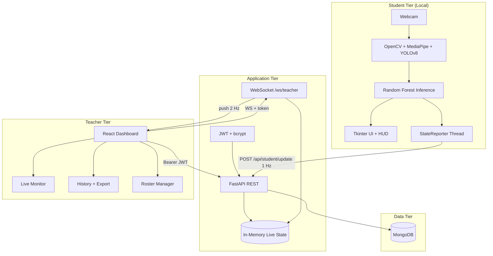
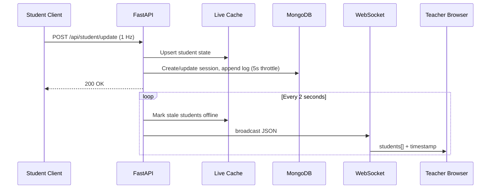
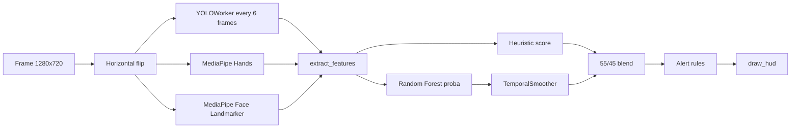

# Attention Monitor

**An Intelligent Real-Time Classroom Attention Monitoring System**  
*Computer Vision · Machine Learning · Full-Stack Web Architecture*

---

## Table of Contents

1. [Executive Summary](#1-executive-summary)
2. [Project Objectives](#2-project-objectives)
3. [System Architecture](#3-system-architecture)
4. [Technology Stack](#4-technology-stack)
5. [Repository Structure](#5-repository-structure)
6. [End-to-End Operational Workflow](#6-end-to-end-operational-workflow)
7. [Student Desktop Application](#7-student-desktop-application)
8. [Computer Vision & Perception Pipeline](#8-computer-vision--perception-pipeline)
9. [Machine Learning & Explainable AI](#9-machine-learning--explainable-ai)
10. [FastAPI Backend](#10-fastapi-backend)
11. [MongoDB Data Layer](#11-mongodb-data-layer)
12. [Real-Time Telemetry & WebSocket Communication](#12-real-time-telemetry--websocket-communication)
13. [Teacher Dashboard (React)](#13-teacher-dashboard-react)
14. [API Reference](#14-api-reference)
15. [Installation & Environment Setup](#15-installation--environment-setup)
16. [Running the System](#16-running-the-system)
17. [Performance Optimizations](#17-performance-optimizations)
18. [Security, Privacy & Ethics](#18-security-privacy--ethics)
19. [Scalability & Deployment](#19-scalability--deployment)
20. [Testing & Continuous Integration](#20-testing--continuous-integration)
21. [Future Improvements](#21-future-improvements)
22. [Academic Documentation Notes](#22-academic-documentation-notes)

---

## 1. Executive Summary

**Attention Monitor** is a capstone-grade, production-oriented software system designed to estimate and visualize student attention in live classroom or remote-learning environments. The system combines:

- A **desktop student client** that processes webcam video **entirely on the local machine** using OpenCV, MediaPipe, and YOLOv8;
- A **supervised machine learning classifier** (Random Forest) trained on multimodal behavioral features;
- A **FastAPI backend** with JWT authentication, class-scoped data isolation, and MongoDB persistence;
- A **React teacher dashboard** for real-time monitoring, historical analytics, and roster management.

Unlike systems that upload raw video to a cloud server, this architecture transmits only **derived metrics** (attention scores, gaze labels, alerts, pose angles)—preserving student privacy while enabling teachers to observe class-wide engagement patterns in near real time.

The codebase is organized into four primary packages—`client/`, `ml/`, `backend/`, and `frontend/`—reflecting a clean separation of concerns suitable for thesis chapters on *perception*, *inference*, *services*, and *human–computer interaction*.

---

## 2. Project Objectives

| Objective | Description | Implementation |
|-----------|-------------|----------------|
| **O1 — Non-intrusive monitoring** | Estimate attention without manual observation | Automated CV + ML pipeline on student workstation |
| **O2 — Real-time teacher awareness** | Sub-second visibility of class state | WebSocket broadcast + in-memory live cache |
| **O3 — Historical accountability** | Review past sessions for pedagogy or research | MongoDB `sessions` collection with embedded logs |
| **O4 — Identity & class governance** | Tie data to teachers, classes, roll numbers | JWT auth, `classes` + `students` collections |
| **O5 — Explainability** | Justify automated labels | SHAP-based local explanations (XAI worker) |
| **O6 — Behavioral safety signals** | Flag phone use, absent face, sustained distraction | Rule-based alert engine on stable ML output |
| **O7 — Deployability** | Reproducible setup for demos and evaluation | Docker Compose, split `requirements/`, CI workflow |

---

## 3. System Architecture

### 3.1 Logical Architecture

The system follows a **three-tier, event-driven architecture**:



### 3.2 Physical Deployment View

| Component | Default Host | Port | Protocol |
|-----------|--------------|------|----------|
| MongoDB | `localhost` | 27017 | MongoDB wire protocol |
| FastAPI + static React build | `localhost` | 8000 | HTTP / WebSocket |
| Vite dev server (optional) | `localhost` | 5173 | HTTP (proxies API) |
| Student client | Student PC | — | HTTP → backend |

### 3.3 Design Principles

1. **Edge inference** — All video processing occurs on the student device; the server never receives frames.
2. **Teacher data isolation** — Queries filter by `teacher_username`; WebSocket streams are class-scoped.
3. **Dual attention signals** — Heuristic score (interpretable geometry) blended with ML probability (data-driven).
4. **Temporal stability** — Rolling-window smoothing prevents UI/alert flicker at classification boundaries.
5. **Write amplification control** — MongoDB log appends are downsampled to one entry every 5 seconds per active session.

---

## 4. Technology Stack

### 4.1 Core Technologies

| Layer | Technology | Version (typical) | Role |
|-------|------------|-------------------|------|
| Language | Python | 3.11–3.14 | Client, backend, ML |
| Language | JavaScript (ES modules) | — | Frontend |
| CV | OpenCV (`cv2`) | 4.8+ | Capture, PnP pose, rendering |
| CV | MediaPipe Tasks | 0.10.x | Face (478 pts) + hand landmarks |
| CV | Ultralytics YOLOv8 | 8.x | Phone detection (COCO class 67) |
| ML | scikit-learn | 1.4+ | Random Forest, StandardScaler |
| ML | SHAP, LIME | — | Global/local explainability (training & HUD) |
| ML | joblib | — | Model artifact serialization |
| API | FastAPI | 0.115+ | Async REST + WebSocket |
| ASGI | Uvicorn | 0.30+ | Production server |
| Auth | PyJWT, bcrypt | — | Token issuance, password hashing |
| Database | MongoDB + PyMongo | 7.x / 4.6+ | Document persistence |
| Frontend | React | 19.x | Component-based dashboard |
| Build | Vite | 8.x | Bundling, dev proxy |
| Charts | Chart.js, react-chartjs-2 | — | Live trend + history visuals |
| Desktop UI | Tkinter | stdlib | Student control panel |
| Viz | Matplotlib (Agg) | — | Post-session analytics plots |

### 4.2 Rationale for Key Technology Choices

| Choice | Why it was selected | Alternatives considered |
|--------|---------------------|-------------------------|
| **MediaPipe Face Landmarker** | Production-grade 478-point mesh, iris indices for gaze, transformation matrices for pose | dlib, OpenFace — heavier setup, fewer integrated blendshapes |
| **OpenCV `solvePnP`** | Standard head pose from 6 canonical 3D–2D point pairs | MediaPipe pose matrix alone — less transparent for thesis diagrams |
| **YOLOv8n** | Lightweight COCO detector; fills `phone_*` training features | Manual HOG/SVM — poorer generalization on phones |
| **Random Forest** | Handles mixed categorical (one-hot pose) + numeric features; robust to noise; `feature_importances_` for XAI | Deep learning on raw pixels — needs far more data, not explainable |
| **FastAPI** | Native async, automatic OpenAPI, WebSocket support, Pydantic validation | Flask + Socket.IO — more boilerplate |
| **MongoDB** | Flexible embedded `logs` arrays per session; horizontal scaling path | PostgreSQL JSONB — viable but more schema friction for nested logs |
| **React + Vite** | Fast HMR for development; static build served by FastAPI in production | Legacy static HTML — harder to maintain at scale |

---

## 5. Repository Structure

```
Project_testing/
├── backend/                      # Server-side application
│   ├── app/
│   │   ├── main.py               # FastAPI routes, WebSocket, static mount
│   │   ├── config.py             # Pydantic settings (.env)
│   │   ├── auth.py               # JWT, bcrypt, rate limiting
│   │   └── database.py           # MongoDB connection & indexes
│   ├── scripts/
│   │   ├── seed_demo.py          # Demo teacher/class/roster
│   │   └── test_auth.py          # Auth smoke test
│   └── tests/                    # pytest integration tests
│
├── client/                       # Student desktop application
│   ├── tracker.py                # Main CV/ML loop + Tkinter UI
│   ├── tracker_legacy.py         # Earlier tracker variant
│   ├── config.example.json       # Optional local defaults
│   ├── assets/mediapipe/         # Downloaded .task model files
│   └── __main__.py               # Entry: python -m client
│
├── ml/                           # Machine learning subsystem
│   ├── model.py                  # Inference API (predict, explain)
│   ├── train_xai.py              # Training + SHAP/LIME pipeline
│   ├── evaluate.py               # Hold-out metrics
│   ├── paths.py                  # Canonical artifact paths
│   ├── data/                     # Training CSV
│   └── artifacts/                # attention_*.pkl (generated)
│
├── frontend/                     # Teacher React dashboard
│   ├── src/
│   │   ├── components/           # Login, LiveMonitor, History, Roster, etc.
│   │   └── api.js                # REST + WebSocket helpers
│   └── dist/                     # Production build (generated)
│
├── legacy/static-dashboard/      # Original HTML dashboard (reference)
├── requirements/                 # Split dependency lists
├── docker-compose.yml
├── Dockerfile
├── .env.example
└── pytest.ini
```

---

## 6. End-to-End Operational Workflow

### 6.1 Phase A — System Bootstrap

1. Administrator starts **MongoDB** and the **FastAPI** server (`uvicorn backend.app.main:app`).
2. Teacher builds or deploys the **React** bundle (`npm run build` → `frontend/dist/`).
3. Teacher registers/logs in, **creates a class** (receives unique `class_code` and `join_code`).
4. Teacher optionally imports a **CSV roster** (`roll_number`, `name`).

### 6.2 Phase B — Student Session

1. Student launches `python -m client`, enters identity fields, accepts **privacy consent**.
2. Webcam captures frames at ~30 FPS (display may be lower due to inference cost).
3. Each frame: extract features → ML inference → smooth → compute alerts → update HUD.
4. **StateReporter** background thread POSTs JSON to `/api/student/update` every **1 second**.
5. Backend updates in-memory live map and appends MongoDB logs every **5 seconds**.

### 6.3 Phase C — Teacher Observation

1. Teacher opens dashboard, selects **active class**.
2. Browser opens **WebSocket** `ws://host/ws/teacher?token=…&class_code=…`.
3. Server pushes filtered student list every **2 seconds** (cleanup task).
4. Teacher views KPIs, per-student cards, alert feed, class trend chart.
5. On session end, student POSTs `/api/student/end`; history remains queryable.

### 6.4 Sequence Diagram — Telemetry Path



---

## 7. Student Desktop Application

**Entry point:** `python -m client` → `client/tracker.py` → `TrackerUI` (Tkinter).

### 7.1 Responsibilities

| Module | Responsibility |
|--------|----------------|
| `TrackerUI` | Collect name, roll number, class code, join code, server URL; consent gate |
| `run_tracking()` | Main OpenCV loop until Q/ESC or stop event |
| `StateReporter` | Daemon thread; resilient HTTP POST with retries |
| `show_dashboard()` | Post-session Matplotlib summary (local only) |

### 7.2 Configuration

Copy `client/config.example.json` → `client/config.json`:

```json
{
  "student_name": "John Doe",
  "roll_number": "ROLL001",
  "class_code": "CS201",
  "join_code": "ABC123",
  "server_url": "http://localhost:8000"
}
```

### 7.3 Privacy Consent Gate

Before webcam activation, the student must confirm a dialog stating:

- Video is processed **locally**;
- Only metrics are transmitted;
- No video recordings are uploaded.

This supports ethical deployment aligned with institutional consent policies.

### 7.4 Keyboard Controls (Live Feed)

| Key | Action |
|-----|--------|
| `Q` / `ESC` | End session |
| `M` | Toggle 478-point face mesh overlay |
| `X` | Toggle XAI reason overlay on HUD |
| `Y` | Toggle YOLO bounding boxes |

---

## 8. Computer Vision & Perception Pipeline

The perception pipeline transforms each BGR frame into a **16-dimensional feature vector** compatible with the trained classifier, plus auxiliary signals for HUD and alerts.

### 8.1 Pipeline Overview



### 8.2 Face Detection & Landmark Extraction

**Technology:** MediaPipe **Face Landmarker** (`face_landmarker.task`, float16).

**Configuration:**

- `num_faces=1` — single-student assumption per workstation;
- `min_face_detection_confidence=0.5`;
- Outputs: 478 landmarks, blendshapes, facial transformation matrix.

**Derived geometry:**

| Output | Method |
|--------|--------|
| Face bounding box | Min/max of normalized landmark x/y → pixel `face_x, face_y, face_w, face_h` |
| `no_of_face` | Binary flag: 1 if landmarks detected |
| Landmark mesh | Optional visualization via `draw_mesh()` |

**Why MediaPipe:** Unified Tasks API, GPU-optional CPU path, iris landmarks (indices 468, 473) enabling gaze without separate eye-region detectors.

### 8.3 Eye Tracking & Blink Detection

#### 8.3.1 Eye Aspect Ratio (EAR)

For each eye, six landmark points define vertical and horizontal distances:

\[
\text{EAR} = \frac{\|p_2-p_6\| + \|p_3-p_5\|}{2 \|p_1-p_4\|}
\]

Left eye indices: `[362, 385, 387, 263, 373, 380]`  
Right eye indices: `[33, 160, 158, 133, 153, 144]`

**Threshold:** `EAR_THRESH = 0.20` — below this, eye considered closed.

#### 8.3.2 BlinkDetector

- Increments blink count when EAR stays below threshold for `EAR_CONSEC_FRAMES` (2) consecutive frames;
- Maintains timestamp deque (120 entries) for **blinks per minute**;
- `eyes_closed` flag triggers when counter exceeds `2 × 3` frames → **EYES CLOSED** alert.

#### 8.3.3 Gaze Estimation (Iris Ratio)

Uses iris center position relative to eye socket width:

- Left eye: outer=33, inner=133, iris=468;
- Right eye: inner=362, outer=263, iris=473;
- Average horizontal ratio `< 0.35` → **Left**; `> 0.65` → **Right**; else **Center**;
- No face → **Away** (triggers heuristic penalty).

This is a lightweight geometric gaze proxy—not a full 3D gaze vector—but sufficient for coarse attention cues in conjunction with head pose.

### 8.4 Head Pose Estimation

**Method:** OpenCV `cv2.solvePnP` with a fixed 3D facial model (`MODEL_3D`) and six 2D image points (`POSE_POINT_IDS`).

**Outputs:** pitch, yaw, roll (degrees).

**Discretization (`pose_bucket`):**

| Condition | Label |
|-----------|-------|
| pitch > 15° | `up` |
| pitch < −15° | `down` |
| yaw > 15° | `right` |
| yaw < −15° | `left` |
| otherwise | `forward` |

Pose is one-hot encoded during ML training (`pose_down`, `pose_forward`, etc.).

### 8.5 Hand Detection

**Technology:** MediaPipe **Hand Landmarker** (up to 2 hands).

**Feature:** `no_of_hand` — integer count passed to the classifier (trained feature from dataset).

### 8.6 Phone Detection (Behavioral Monitoring)

**Technology:** **YOLOv8n** (Ultralytics), COCO class **67** (`cell phone`), confidence ≥ 0.40.

**Optimization:** `YOLOWorker` runs inference on a **background thread** every **6 frames** to reduce main-loop latency.

**Features populated:**

```
phone, phone_x, phone_y, phone_w, phone_h, phone_con
```

**Alert:** `PHONE DETECTED` when `phone == 1`.

### 8.7 Heuristic Attention Score (0–100)

Parallel interpretable score combining:

| Component | Weight | Logic |
|-----------|--------|-------|
| Head pose penalty | 50% | yaw/pitch deviation from forward |
| Gaze | 30% | Center=1.0, Left/Right=0.4, Away=0.0 |
| Eye openness (EAR) | 20% | Normalized EAR / 0.22 |
| No face | — | Immediate score 0 |

**Final blend per frame:**

```
attention = int(0.55 × heuristic + 0.45 × smoothed_prob × 100)
```

This hybrid design keeps the HUD responsive when the ML model is uncertain while anchoring long-term behavior to learned patterns.

### 8.8 Temporal Smoothing & Stable Labels

**Class:** `TemporalSmoother(window=15, low=0.45, high=0.55)`

- Maintains deque of raw ML probabilities (~0.5 s at 30 FPS);
- **Hysteresis:** label switches to distracted only if mean < 0.45; back to attentive only if mean > 0.55;
- Prevents single-frame noise from flipping `model_pred_stable`;
- Alerts like **SUSTAINED DISTRACTION** require `window_full` and `stable_label == 0`.

### 8.9 Alert Generation Engine

Alerts are evaluated **after** smoothing, in priority order:

| Priority | Condition | Alert string |
|----------|-----------|--------------|
| 1 | No face landmarks | `NO FACE` |
| 2 | Prolonged eye closure | `EYES CLOSED` |
| 3 | blinks/min > 25 | `HIGH BLINK RATE` |
| 4 | Phone detected | `PHONE DETECTED` |
| 5 | Stable distraction + full window | `SUSTAINED DISTRACTION` |

Empty alert string means nominal monitoring. Alerts are stored in MongoDB logs and surfaced in the teacher **Live Alerts** feed.

### 8.10 Explainable AI (On-Device HUD)

**Class:** `XAIWorker(every_n=20)` — asynchronously calls `ml.model.explain_prediction()` using SHAP TreeExplainer.

Surfaces top positive/negative features on the OpenCV HUD when enabled (`X` key).

---

## 9. Machine Learning & Explainable AI

### 9.1 Problem Formulation

**Task:** Binary classification — `label ∈ {0, 1}` (Not Attentive / Attentive).

**Input:** 16 engineered features per frame (see `FEATURE_KEYS` in `client/tracker.py`).

**Dataset:** `ml/data/attention_detection_dataset_v1.csv` (~4000 labeled samples).

### 9.2 Feature Vector Schema

| Feature | Type | Description |
|---------|------|-------------|
| `no_of_face` | int | Face detected flag |
| `face_x, face_y, face_w, face_h` | float | Bounding box geometry |
| `face_con` | float | Confidence proxy |
| `no_of_hand` | int | Hand count |
| `pose` | categorical | forward/up/down/left/right |
| `pose_x, pose_y` | float | Yaw/pitch degrees |
| `phone, phone_*` | int/float | Phone presence & box |
| `phone_con` | float | Detection confidence |

### 9.3 Training Pipeline (`ml/train_xai.py`)

1. **Preprocess:** `fillna(0)` → drop `label` → `pd.get_dummies(pose)`;
2. **Split:** 80/20 stratified `train_test_split`;
3. **Scale:** `StandardScaler` → persisted as `attention_scaler.pkl`;
4. **Baseline:** Logistic Regression (evaluation only);
5. **Production model:** `GridSearchCV` over `RandomForestClassifier` (F1 scoring);
6. **Persist:** `attention_model.pkl`, `attention_columns.pkl`;
7. **XAI artifacts:** SHAP summary, permutation importance, LIME plots → `ml/outputs/xai/`.

**Train command:**

```bash
python -m ml
```

**Evaluate command:**

```bash
python -m ml.evaluate
```

### 9.4 Inference API (`ml/model.py`)

| Function | Returns |
|----------|---------|
| `predict_attention(features)` | `0` or `1` |
| `predict_proba_attention(features)` | \( P(\text{attentive}) \in [0,1] \) |
| `explain_prediction(features)` | dict with SHAP contributions + text |

**Preprocessing alignment:** One-hot pose → align to `attention_columns.pkl` → scaler transform. Mismatch between training and live features would silently degrade accuracy; column order is frozen in the pickle artifact.

### 9.5 Why Random Forest Over Deep Learning

| Criterion | Random Forest | CNN on pixels |
|-----------|---------------|---------------|
| Training data size | Works with thousands of rows | Needs orders of magnitude more |
| Feature interpretability | SHAP on tabular features | Grad-CAM — less aligned with pose/phone flags |
| CPU inference latency | Milliseconds | Higher without GPU |
| Alignment with dataset | Trained on same 16 features extracted live | Would require retraining end-to-end |

---

## 10. FastAPI Backend

**Module:** `backend/app/main.py`  
**ASGI entry:** `uvicorn backend.app.main:app`

### 10.1 Application Lifecycle

```python
@asynccontextmanager
async def lifespan(app):
    bg_task = asyncio.create_task(cleanup_task())  # 2s broadcast loop
    yield
    bg_task.cancel()
    close_db()
```

### 10.2 Middleware & Configuration

| Setting | Source | Purpose |
|---------|--------|---------|
| `CORS_ORIGINS` | `.env` | Restrict browser origins (not `*` in production) |
| `JWT_SECRET` | `.env` | HS256 signing; enforced in production mode |
| `REQUIRE_JOIN_CODE` | `.env` | Optional student join verification |
| `SESSION_LOG_INTERVAL_SEC` | `.env` | MongoDB write throttle (default 5s) |
| `STUDENT_STALE_SEC` | `.env` | Offline detection threshold (default 8s) |

### 10.3 Authentication Flow

1. `POST /api/auth/register` — bcrypt hash stored in `teachers`;
2. `POST /api/auth/login` — returns `access_token` (24h default);
3. Protected routes require `Authorization: Bearer <token>`;
4. WebSocket passes `?token=` query parameter (browser API limitation).

**Rate limiting:** In-memory sliding window on auth and telemetry endpoints (`backend/app/auth.py`).

### 10.4 In-Memory Live State

```python
students: Dict[str, dict]  # key = "CLASS_CODE:ROLL_NUMBER"
```

Teacher WebSocket entries store `{ws, username, class_code}` for filtered broadcast.

**Stale detection:** If `now - last_update > STUDENT_STALE_SEC`, status → `offline`, alert → `DISCONNECTED`, MongoDB session closed.

---

## 11. MongoDB Data Layer

**Database name:** `attention_tracker` (configurable via `MONGODB_DB`).

### 11.1 Collections

#### `teachers`

```json
{
  "username": "demo",
  "password_hash": "<bcrypt>",
  "registered_at": 1710000000.0
}
```

**Index:** `username` (unique).

#### `classes`

```json
{
  "class_code": "CS201",
  "display_name": "Introduction to CS",
  "teacher_username": "demo",
  "join_code": "A1B2C3",
  "created_at": 1710000000.0
}
```

**Index:** `class_code` (unique); `teacher_username`.

#### `students` (roster)

```json
{
  "class_code": "CS201",
  "roll_number": "ROLL001",
  "name": "Alice Johnson",
  "created_at": 1710000000.0
}
```

**Index:** `(class_code, roll_number)` unique compound.

#### `sessions`

```json
{
  "name": "Alice Johnson",
  "roll_number": "ROLL001",
  "class_code": "CS201",
  "teacher_username": "demo",
  "start_time": 1710000000.0,
  "end_time": null,
  "status": "active",
  "logs": [
    {"attention": 82, "alert": "", "timestamp": 1710000005.0}
  ],
  "last_active": 1710000005.0
}
```

**Indexes:** `(class_code, roll_number, status)`; `(teacher_username, start_time)`; optional TTL on `start_time` (`SESSION_TTL_DAYS`).

### 11.2 Data Governance

- Teachers only query sessions where `teacher_username` matches JWT subject;
- Reset/session end scoped to `class_code`;
- Roster mismatch can reject telemetry when registered name differs from live name.

---

## 12. Real-Time Telemetry & WebSocket Communication

### 12.1 Student → Server (HTTP)

**Endpoint:** `POST /api/student/update`  
**Frequency:** ~1 Hz (`StateReporter._report_loop`)  
**Payload (excerpt):**

```json
{
  "name": "Alice",
  "roll_number": "ROLL001",
  "class_code": "CS201",
  "join_code": "ABC123",
  "attention": 78,
  "model_prob_smoothed": 0.81,
  "model_prob_raw": 0.79,
  "model_pred_stable": 1,
  "phone_detected": false,
  "hands_count": 0,
  "blinks": 12,
  "blinks_per_min": 18.5,
  "gaze": "Center",
  "pose_pitch": -2.1,
  "pose_yaw": 4.3,
  "pose_roll": 0.5,
  "alert": ""
}
```

**End session:** `POST /api/student/end` with `{roll_number, class_code}`.

### 12.2 Server → Teacher (WebSocket)

**Endpoint:** `GET ws://host/ws/teacher?token=JWT&class_code=CS201`

**Message format (every ~2 s):**

```json
{
  "students": [ { "name": "...", "roll_number": "...", "attention": 78, "status": "active", ... } ],
  "timestamp": 1710000010.5
}
```

**Initial snapshot:** Sent immediately on connect.

### 12.3 Teacher → Server (HTTP)

Authenticated REST for class CRUD, roster, history, export, session delete, reset.

---

## 13. Teacher Dashboard (React)

**Location:** `frontend/src/`  
**Production URL:** `http://localhost:8000/` (static files from `frontend/dist/`).

### 13.1 Application Structure

| Component | Function |
|-----------|----------|
| `Login.jsx` / `Register.jsx` | JWT acquisition, localStorage persistence |
| `ClassSelector.jsx` | Create/select class; display join code |
| `LiveMonitor.jsx` | WebSocket grid, KPIs, Chart.js trend, alerts |
| `HistoryPanel.jsx` | Session table, CSV export, drill-down modal |
| `SessionDetail.jsx` | Per-session attention timeline; delete record |
| `RosterPanel.jsx` | Add/remove students, CSV import |
| `StudentCard.jsx` | Per-student live metrics visualization |

### 13.2 Development vs Production

| Mode | Command | URL |
|------|---------|-----|
| Production | `npm run build` + FastAPI | `:8000` |
| Development | `npm run dev` | `:5173` (Vite proxies `/api`, `/ws`) |

### 13.3 State Management

- Auth token: `localStorage.auth_token`;
- Active class: `localStorage.active_class_code`;
- WebSocket reconnect with 3 s backoff on disconnect.

---

## 14. API Reference

Interactive documentation: **`http://localhost:8000/docs`** (Swagger UI).

### 14.1 Health

| Method | Path | Auth | Description |
|--------|------|------|-------------|
| GET | `/api/health` | No | Liveness |
| GET | `/api/ready` | No | MongoDB connectivity |

### 14.2 Authentication

| Method | Path | Body |
|--------|------|------|
| POST | `/api/auth/register` | `{username, password}` |
| POST | `/api/auth/login` | `{username, password}` |
| GET | `/api/auth/me` | Bearer token |

### 14.3 Classes & Roster

| Method | Path | Description |
|--------|------|-------------|
| POST | `/api/classes` | Create class |
| GET | `/api/classes` | List teacher's classes |
| GET | `/api/classes/{code}/roster` | List roster |
| POST | `/api/classes/{code}/roster` | Add student |
| DELETE | `/api/classes/{code}/roster/{roll}` | Remove student |
| POST | `/api/classes/{code}/roster/import` | JSON bulk import |
| POST | `/api/classes/{code}/roster/import-csv` | CSV file upload |

### 14.4 Telemetry (Student)

| Method | Path | Auth |
|--------|------|------|
| POST | `/api/student/update` | No (join code optional) |
| POST | `/api/student/end` | No |

### 14.5 Analytics (Teacher)

| Method | Path | Description |
|--------|------|-------------|
| GET | `/api/session/reset?class_code=` | End live sessions for class |
| GET | `/api/analytics/history?class_code=` | Session summaries |
| GET | `/api/analytics/session/{id}` | Full logs |
| DELETE | `/api/analytics/session/{id}` | GDPR-style removal |
| GET | `/api/analytics/history/export?class_code=` | CSV download |

### 14.6 WebSocket

| Path | Params |
|------|--------|
| `/ws/teacher` | `token`, optional `class_code` |

---

## 15. Installation & Environment Setup

### 15.1 Prerequisites

- Python 3.11 or newer  
- Node.js 20 or newer  
- MongoDB 7.x (local or Atlas)  
- Webcam (student machine)  
- Windows / Linux / macOS  

### 15.2 Clone & Python Dependencies

```powershell
cd d:\Capstone\Project_testing
pip install -r requirements.txt
copy .env.example .env
```

**Split installs (optional):**

```powershell
pip install -r requirements/backend.txt
pip install -r requirements/client.txt
pip install -r requirements/ml.txt
```

### 15.3 Environment Variables

| Variable | Default | Description |
|----------|---------|-------------|
| `ENVIRONMENT` | `development` | Set `production` to enforce strong `JWT_SECRET` |
| `JWT_SECRET` | (dev placeholder) | **Required** in production |
| `MONGODB_URI` | `mongodb://localhost:27017` | Connection string |
| `MONGODB_DB` | `attention_tracker` | Database name |
| `CORS_ORIGINS` | localhost URLs | Comma-separated |
| `REQUIRE_JOIN_CODE` | `false` | Enforce class join code on telemetry |
| `SESSION_LOG_INTERVAL_SEC` | `5` | MongoDB log throttle |
| `STUDENT_STALE_SEC` | `8` | Offline timeout |
| `SESSION_TTL_DAYS` | `90` | Auto-expire old sessions (0=disable) |

### 15.4 ML Artifacts

If `ml/artifacts/*.pkl` are missing:

```powershell
python -m ml
```

MediaPipe models download automatically to `client/assets/mediapipe/` on first client run.

### 15.5 Frontend Build

```powershell
cd frontend
npm install
npm run build
```

---

## 16. Running the System

### 16.1 Standard Local Deployment

**Terminal 1 — Database & API:**

```powershell
# Ensure MongoDB is running
cd d:\Capstone\Project_testing
python -m backend.scripts.seed_demo
python -m uvicorn backend.app.main:app --reload --host 127.0.0.1 --port 8000
```

**Terminal 2 — Teacher UI:**

Open **http://localhost:8000** (after `npm run build`).

Or development mode:

```powershell
cd frontend
npm run dev
# → http://localhost:5173
```

**Terminal 3 — Student client:**

```powershell
cd d:\Capstone\Project_testing
copy client\config.example.json client\config.json
python -m client
```

### 16.2 Docker Compose

```powershell
docker compose up --build
```

Services: `mongo` (27017), `api` (8000). Set `JWT_SECRET` in `.env` or compose overrides.

### 16.3 Verification Commands

```powershell
pytest
python -m backend.scripts.test_auth
python -m ml.evaluate
```

---

## 17. Performance Optimizations

| Optimization | Location | Impact |
|--------------|----------|--------|
| YOLO every 6 frames | `YOLOWorker` | ~6× reduction in detector cost |
| XAI every 20 frames | `XAIWorker` | SHAP not on critical path |
| Lazy model singletons | `ml/model.py`, MediaPipe getters | One-time load cost |
| Temporal smoothing | `TemporalSmoother` | Reduces alert/WS noise |
| MongoDB log downsampling | `main.py` update handler | Prevents log array bloat |
| In-memory live cache | `students` dict | O(1) teacher broadcast reads |
| Async cleanup task | 2 s interval | Decoupled from request latency |
| Matplotlib Agg backend | `tracker.py` | No GUI conflict with Tkinter |
| JWT / teacher scoping | All analytics queries | Smaller working sets |

**Bottleneck notes:** MediaPipe face + hands per frame dominate CPU on student machines; GPU optional via MediaPipe env flags. For classrooms >50 concurrent students, scale API horizontally with shared MongoDB and sticky sessions or Redis pub/sub for WebSocket fan-out (future work).

---

## 18. Security, Privacy & Ethics

### 18.1 Privacy by Design

| Principle | Implementation |
|-----------|----------------|
| **Data minimization** | Only scalar metrics transmitted |
| **Local processing** | Webcam never leaves student device |
| **Consent** | Tkinter dialog before capture |
| **Retention control** | Session TTL index; teacher delete API |
| **Access control** | JWT + per-teacher query filters |

### 18.2 Security Controls

| Control | Detail |
|---------|--------|
| Password storage | bcrypt salted hashes |
| API authentication | Bearer JWT (HS256) |
| WebSocket auth | Token query param validated |
| Rate limiting | Auth + telemetry endpoints |
| CORS | Configurable origin whitelist |
| Production guard | Refuses default `JWT_SECRET` when `ENVIRONMENT=production` |
| Join codes | Optional `REQUIRE_JOIN_CODE` prevents arbitrary class injection |

### 18.3 Ethical Considerations for Deployment

- Obtain **informed consent** from students and institutional approval;
- Avoid using attention scores as high-stakes grading inputs without validation;
- Disclose monitoring to all participants;
- Comply with FERPA/GDPR/local regulations regarding educational data;
- Provide opt-out mechanisms where required.

### 18.4 Known Limitations

- Gaze estimation is geometric, not calibrated per user;
- Lighting, ethnicity, glasses, and camera angle affect EAR and pose;
- ML model accuracy bounded by training dataset diversity;
- Single-face assumption fails for group webcam views.

---

## 19. Scalability & Deployment

### 19.1 Vertical Scaling

Increase Uvicorn workers **only with shared state refactor** (current live map is in-process). For single-classroom demos, one worker suffices.

### 19.2 Horizontal Scaling Path

1. Externalize `students` cache to **Redis**;
2. Use **Redis pub/sub** or message broker for WebSocket fan-out;
3. MongoDB replica set for read scaling on history;
4. CDN for `frontend/dist` static assets;
5. TLS termination at nginx/Traefik.

### 19.3 CI/CD

GitHub Actions workflow (`.github/workflows/ci.yml`):

- Backend tests with MongoDB service container;
- Frontend production build verification.

---

## 20. Testing & Continuous Integration

```powershell
pytest                    # backend/tests — API + roster CSV
python -m backend.scripts.test_auth
```

| Test module | Coverage |
|-------------|----------|
| `test_api.py` | Health, class creation, telemetry |
| `test_roster.py` | CSV import, delete |

---

## 21. Future Improvements

| Area | Proposed enhancement |
|------|---------------------|
| **Packaging** | PyInstaller/CX_Freeze student `.exe` |
| **Strict roster mode** | Reject telemetry if roll not enrolled |
| **Redis layer** | Multi-instance WebSocket sync |
| **Per-user gaze calibration** | Personal baseline for iris ratio |
| **LSTM temporal model** | Sequence model over frame windows |
| **Mobile client** | Android/iOS via React Native bridge |
| **LTI integration** | LMS plugins (Moodle, Canvas) |
| **Federated learning** | Privacy-preserving model updates |
| **HTTPS & OAuth2** | Institutional SSO |
| **Bias audit suite** | Fairness metrics across subgroups |
| **Playwright E2E** | Full teacher workflow automation |

---

## 22. Academic Documentation Notes

This README is structured to map directly to thesis or project report chapters:

| Chapter | Source sections |
|---------|-----------------|
| Introduction | §1, §2 |
| Literature / Related work | §4.2, §18.4 |
| System design | §3, §5, §6 |
| Methodology — CV | §8 |
| Methodology — ML | §9 |
| Implementation | §7, §10, §11, §13 |
| Evaluation | §9.3, `ml/evaluate.py`, §18.4 |
| Security & ethics | §18 |
| Deployment | §15, §16, §19 |
| Conclusion & future work | §21 |

**Suggested figures for report:** Architecture diagram (§3.1), sequence diagram (§6.4), CV pipeline flowchart (§8.1), ER-style collection schemas (§11.1), screenshot placeholders for HUD + dashboard.

**Dataset citation:** Document `ml/data/attention_detection_dataset_v1.csv` provenance, collection protocol, and label definition in your methodology chapter.

---

## License & Attribution

Academic / capstone use — add institutional license and author names as required by your department.

For questions or reproduction of experiments, refer to `http://localhost:8000/docs` and the module docstrings in `client/tracker.py`, `ml/train_xai.py`, and `backend/app/main.py`.

---

*Document version aligned with repository layout: `backend/`, `client/`, `ml/`, `frontend/`.*
